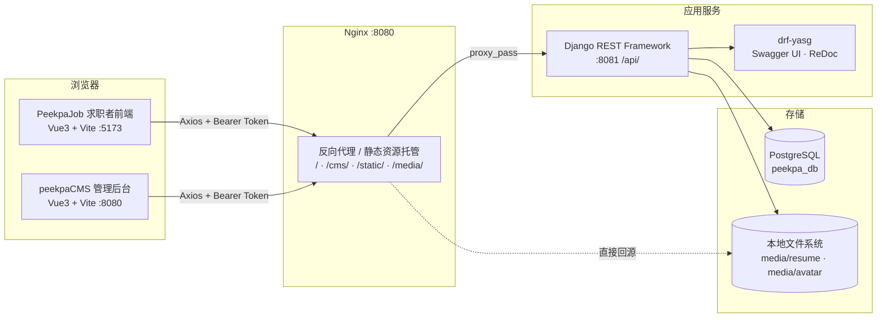
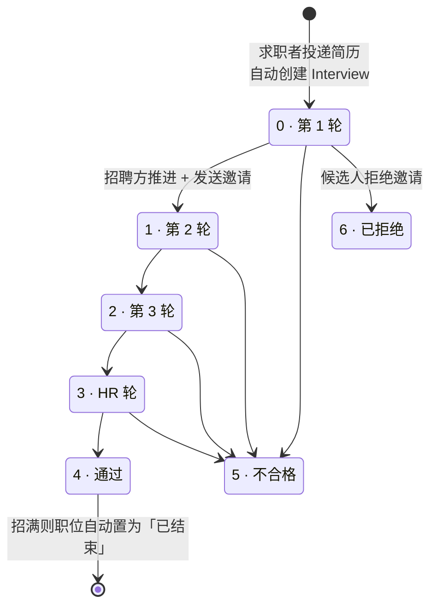

<div align="center">

# PeekpaJob · 在线招聘系统

**基于 Django REST Framework + Vue 3 + TypeScript 的前后端分离招聘平台**

`Django 4.2` · `DRF 3.14` · `SimpleJWT` · `Vue 3.5` · `Vite 7` · `Pinia 3` · `Element Plus 2.11` · `PostgreSQL`

</div>

---

## 目录

- [项目概览](#项目概览)
- [系统架构](#系统架构)
- [目录结构](#目录结构)
- [技术栈](#技术栈)
- [功能模块](#功能模块)
- [核心实现方法](#核心实现方法)
- [API 一览](#api-一览)
- [数据字典](#数据字典)
- [快速开始](#快速开始)
- [生产部署](#生产部署)
- [已知问题与改进建议](#已知问题与改进建议)
- [安全注意事项](#安全注意事项)

---

## 项目概览

本项目是一套完整的在线招聘系统，采用前后端分离架构，由 **三个可独立部署的子系统** 组成：

| 子系统 | 目录 | 角色 | 技术形态 |
| --- | --- | --- | --- |
| **招聘平台 API 服务** | `PeekpaBackend1/` | 统一后端，提供全部 RESTful 接口与 Swagger 文档 | Django 4.2 + DRF |
| **求职者前端** | `PeekpaJob/` | 面向 C 端求职者：浏览职位、投递简历、跟踪进度 | Vue 3 + TS + Vite |
| **CMS 后台管理系统** | `peekpaCMS/` | 面向 B 端：超级管理员 / 公司管理员 / 公司职员 | Vue 3 + TS + Vite |

两个前端共用同一套 API 与同一套认证协议（JWT），但使用 **不同的 localStorage Key**（`PeekpaJob` / `PeekpaJobCMS`）隔离登录态，因此可以在同一浏览器中同时以求职者和管理员身份登录。

---

## 系统架构

> 下图为**生产部署的目标拓扑**：Nginx 作为统一入口监听 `:8080`，Django 退居内网 `:8081`。
> 开发模式下不启用 Nginx，Django 直接监听 `8080`，两个前端由 Vite dev server 提供 —— PeekpaJob 未显式配置端口（Vite 默认 `:5173`），CMS 在 `vite.config.ts` 中指定为 `:8080`，详见[快速开始](#快速开始)。



**一次典型请求的链路**

```
Vue 组件 → services/xxx/index.ts → Axios 实例（请求拦截器注入 Bearer Token）
  → Nginx /api/ → Django 中间件（CORS）→ DRF 认证类（JWTAuthentication / PassGetAuthentication）
  → 权限类（IsSuperUser / IsCompanyAdminUser / IsAuthenticated）
  → View.get_queryset()（按 company_id 二次收敛数据范围）
  → FilterSet（模糊搜索 / 排序）→ LimitOffsetPagination（分页）
  → Serializer（按角色裁剪字段）→ JSON 响应
  → Axios 响应拦截器（统一处理 401）→ 组件渲染
```

---

## 目录结构

```
job-cruitment/
├── PeekpaBackend1/                    # 后端：Django 项目
│   ├── manage.py
│   ├── PeekpaBackend1/                # 项目级配置
│   │   ├── settings.py                #   数据库 / DRF / SimpleJWT / Swagger / CORS / Media
│   │   ├── urls.py                    #   Swagger 入口 + 挂载 apps.api.urls
│   │   ├── views.py                   #   BothHttpAndHttpsSchemaGenerator
│   │   ├── requirements.txt           #   Python 依赖清单
│   │   ├── asgi.py / wsgi.py
│   ├── apps/
│   │   ├── api/                       # 【核心】全部 API 实现
│   │   │   ├── urls.py                #   26 条路由
│   │   │   ├── authentications.py     #   PeekpaAccessToken / PassGetAuthentication
│   │   │   ├── permissions.py         #   IsCompanyAdminUser / IsSuperUser / IsGetForAll
│   │   │   ├── serializers.py         #   20+ 序列化器
│   │   │   ├── view_auth.py           #   注册 / 登录 / 登出 / 个人资料 / 员工与公司管理
│   │   │   ├── view_job.py            #   简历与头像上传 / 职位列表详情 / 投递
│   │   │   ├── view_company.py        #   公司列表与详情
│   │   │   ├── view_index.py          #   首页聚合数据
│   │   │   └── view_manage.py         #   CMS 后台：职位 / 面试 / 邀请 / 仪表盘
│   │   ├── peekpauser/                # 自定义用户模型 User + Avatar
│   │   ├── company/                   # 公司模型 Company
│   │   ├── job/                       # Resume / Job / PublishJob / Interview / Invitation
│   ├── media/                         # 上传文件存储（avatar/ resume/）
│
├── PeekpaJob/                         # 前端：求职者站点
│   ├── vite.config.ts                 #   Element Plus 按需自动导入；未指定端口，dev 走 Vite 默认 5173
│   ├── .env.development               #   开发环境地址配置（仓库未提供 .env.production）
│   ├── peekpajob.conf                 #   Nginx 部署配置样例
│   └── src/
│       ├── main.ts                    #   应用入口 + 全局图标注册
│       ├── App.vue
│       ├── route/                     #   Hash 路由 + 常量
│       ├── store/modules/User.ts      #   Pinia：令牌与用户信息
│       ├── services/                  #   Axios 实例 + 按域划分的 API 封装
│       ├── pages/                     #   IndexBasePage 分发 + 各业务页面
│       ├── components/                #   JobCard / CompanyCard / Banner / Filter …
│       ├── constants/filter.ts        #   筛选项字典（经验 / 学历 / 规模 / 排序）
│       └── types/                     #   TS 接口定义
│
├── peekpaCMS/                         # 前端：管理后台
│   ├── vite.config.ts                 #   base: '/cms/'，dev server 端口 8080
│   ├── .env.development               #   开发环境地址配置（仓库未提供 .env.production）
│   ├── peekpajob.conf                 #   Nginx 配置样例（仅托管 CMS）
│   └── src/
│       ├── route/index.ts             #   路由表与 meta 权限声明（无全局守卫消费它）
│       ├── store/modules/
│       │   ├── User.ts                #   Pinia：令牌与用户信息
│       │   └── PermissionConstants.ts #   MANAGER / SUPERUSER 常量枚举
│       ├── pages/                     #   BasePage 布局 + CMSBasePage 分发
│       ├── components/                #   Header / Sidebar / DashboardCard / Clock
│       └── services/ · types/ · utils/
│
├── .vscode/                          # 编辑器配置
├── venv_1/                           # ⚠️ 开发者本地虚拟环境，误入库（12984 个文件 / 约 46 MB）
├── package.json                      # ⚠️ 遗留文件，声明的版本与两个前端均不一致，实际不起作用
├── package-lock.json                 # ⚠️ 同上
├── db.sqlit3                         # ⚠️ 遗留文件，文件名拼写有误（应为 sqlite3）
├── .gitignore
└── README.md
```

> 标有 ⚠️ 的四项均为应当清理的遗留内容，详见[已知问题与改进建议](#已知问题与改进建议)。

---

## 技术栈

### 后端

| 类别 | 技术 | 版本 | 用途 |
| --- | --- | --- | --- |
| 语言 | Python | 3.10 | 运行环境 |
| Web 框架 | Django | 4.2.1 | ORM、迁移、Admin、中间件 |
| API 框架 | djangorestframework | 3.14.0 | 序列化、泛型视图、分页、认证 |
| 认证 | djangorestframework-simplejwt | 5.2.2 | JWT 签发 / 校验 / **Token 黑名单** |
| 认证 | PyJWT | 2.7.0 | JWT 底层编解码 |
| 过滤 | django-filter | 23.2 | `FilterSet` 声明式查询过滤 |
| 文档 | drf-yasg | 1.21.5 | 自动生成 Swagger UI / ReDoc |
| 跨域 | django-cors-headers | 4.0.0 | CORS 中间件 |
| 主键 | django-shortuuidfield | 0.1.3 | 用户 `uid` 短唯一标识 |
| 数据库驱动 | psycopg2 | 2.9.6 | PostgreSQL 连接 |
| 数据库 | PostgreSQL | 13+ | 主数据存储（依赖 `JSONField` 与 `__contains` 查询） |

> 完整依赖见 [`PeekpaBackend1/PeekpaBackend1/requirements.txt`](PeekpaBackend1/PeekpaBackend1/requirements.txt)（30 个包，全部锁定版本），**上表版本号均以这份清单为准**。
>
> ⚠️ 仓库内附带了一个 `venv_1/` 虚拟环境目录，但它与这份清单**并不同步**（12 个声明依赖完全未安装、另有 15 个版本漂移），请勿直接拿它运行项目，详见[已知问题与改进建议](#已知问题与改进建议)。

### 前端（两个项目依赖一致）

| 类别 | 技术 | 版本 | 用途 |
| --- | --- | --- | --- |
| 框架 | Vue | 3.5.18 | 组合式 API + `<script setup>` SFC |
| 语言 | TypeScript | 5.8.3 | 全量类型化 |
| 构建 | Vite | 7.1.x | 开发服务器与打包 |
| 类型检查 | vue-tsc | 3.0.x | `npm run build` 前置类型校验 |
| 路由 | Vue Router | 4.5.1 | **Hash 模式** + 懒加载 + 全局守卫 |
| 状态管理 | Pinia | 3.0.3 | 用户令牌与登录态 |
| UI 组件库 | Element Plus | 2.11.1 | 页面布局与交互组件 |
| 图标 | @element-plus/icons-vue | 2.3.2 | 全局注册为 `Eli*` 组件 |
| HTTP | Axios | 1.11.0 | 请求 / 响应拦截器 |
| JWT 解析 | jwt-decode | 3.1.2 | 前端直接解码 Token 载荷 |
| 表单校验 | async-validator | 4.2.5 | Element Plus 表单规则底层 |
| 自动导入 | unplugin-auto-import | 20.1.0 | Vue API 免 import |
| 组件解析 | unplugin-vue-components | 29.0.0 | Element Plus 按需引入 |
| TS 预设 | @vue/tsconfig | 0.7.0 | 分层 tsconfig 继承 |

> 构建工具链要求 **Node.js ≥ 20.19**（Vite 7 的最低要求），推荐使用 Node 22 LTS。

### 部署与运维

| 技术 | 用途 |
| --- | --- |
| Nginx | 静态资源托管、`/api/` 反向代理、`/media/` 与 `/static/` 直出并设置 30 天缓存 |
| `hash` 路由模式 | 前端无需服务端 fallback 配置即可刷新任意页面 |
| `base: '/cms/'` | CMS 构建产物挂载到子路径，与求职者站点共用同一域名端口 |
| `.env.development` | Vite 开发环境变量；两个项目**均未提供** `.env.production`，生产构建时 `VITE_*` 全部为 `undefined` |

---

## 功能模块

### 求职者前端（PeekpaJob）

| 模块 | 说明 |
| --- | --- |
| 首页 | 轮播 Banner、职位分类导航（技术 / 产品 / 设计 / 运营 / 市场 / 销售 / 职能 / 游戏）、推荐职位与热门公司榜单 |
| 职位检索 | 关键词模糊搜索、按工作经验 / 学历要求筛选、按最新发布时间排序、分页浏览 |
| 职位详情 | 薪资、城市、经验、学历、福利、职位描述、公司信息，以及"是否已上传简历 / 是否已投递"状态 |
| 公司检索 | 按公司名称搜索、按公司类型（标签）与规模筛选、按在招职位数排序 |
| 公司详情 | 公司主页信息与全部在招职位 |
| 注册登录 | 邮箱注册（注册即自动登录）、邮箱密码登录 |
| 个人中心 | 修改姓名 / 性别 / 密码、上传与更换头像、上传与下载简历 |
| 职位投递 | 一键投递，服务端校验登录态、账号类型、简历有效性 |
| 申请进度 | 查看每份投递的面试轮次状态、面试邀请消息，并可回复邀请（同意 / 拒绝） |

### CMS 管理后台（peekpaCMS）

| 模块 | 可见角色 | 说明 |
| --- | --- | --- |
| 登录 | 全部 | 管理员专用登录入口（`is_staff=True`） |
| 数据仪表盘 | 全部 | 职位总数 / 在招 / 已结束 / 已下架、面试中数量、简历总数、今日新增简历、邀请数、员工数、招聘人数、通过人数、最新职位与最新面试列表 |
| 发布职位 | 全部 | 创建职位并自动关联当前公司与发布人 |
| 职位管理 | 全部 | 职位列表、搜索、查看详情 |
| 面试管理 | 全部 | 按职位筛选面试、推进面试轮次、填写各轮反馈、发送面试邀请、下载候选人简历 |
| 员工管理 | 公司管理员 | 增删改本公司职员 |
| 公司管理 | 超级管理员 | 创建公司并同时创建其管理员账号 |
| 修改资料 | 全部 | 修改公司头像、标语、规模、标签、简介与登录密码 |
| 实时时钟 | 全部 | 顶栏时钟组件 |

### API 服务（PeekpaBackend1）

- **26 个 RESTful 端点**，覆盖认证、职位、公司、简历、面试、邀请、仪表盘
- **Swagger UI**（`/`）与 **ReDoc**（`/redoc/`）文档，随代码自动同步生成
- **三级权限模型**：超级管理员 / 公司管理员 / 公司职员，叠加数据行级隔离
- **文件上传下载**：简历（docx 等）与头像，落盘到 `media/` 并由 Nginx 直出

---

## 核心实现方法

> 本节说明项目中实际采用的关键技术手段与设计模式，是理解代码的主线。

### 一、认证机制：可扩展载荷的自定义 JWT

**1. 在 Token 中携带业务身份**

继承 SimpleJWT 的 `AccessToken` 并混入 `BlacklistMixin`，重写 `for_user()` 向载荷注入自定义声明（`apps/api/authentications.py`）：

```python
class PeekpaAccessToken(BlacklistMixin, AccessToken):
    token_type = "access"

    @classmethod
    def for_user(cls, user):
        token = super().for_user(user)
        token['is_staff'] = user.is_staff
        token['email'] = user.email
        token['name'] = user.name
        if 'company_id' in user.details:
            token['is_manager'] = user.details.get('is_manager', False)
        if user.is_superuser:
            token['is_superuser'] = user.is_superuser
        return token
```

再通过 `settings.py` 的 `SIMPLE_JWT['AUTH_TOKEN_CLASSES']` 全局替换默认 Token 类。**收益**：前端只需用 `jwt-decode` 解码本地 Token 即可拿到角色信息，无需额外的"获取当前用户"请求，菜单权限渲染零网络开销。

**2. 自定义 Token 生命周期与主键声明**

```python
SIMPLE_JWT = {
    "AUTH_HEADER_TYPES": ["Bearer"],
    "USER_ID_FIELD": "uid",          # 与自定义 User 模型的 ShortUUID 主键对齐
    'USER_ID_CLAIM': 'uid',
    'ALGORITHM': 'HS256',
    'SIGNING_KEY': SECRET_KEY,
    'ACCESS_TOKEN_LIFETIME': datetime.timedelta(days=5),
    'REFRESH_TOKEN_LIFETIME': datetime.timedelta(days=1),
}
```

**3. 登出即失效：Token 黑名单**

将 `rest_framework_simplejwt.token_blacklist` 加入 `INSTALLED_APPS`，登出接口调用 `request.auth.blacklist()` 把当前 Token 写入黑名单表，实现**服务端主动吊销**（而非仅前端清除 localStorage）：

```python
class LogoutView(APIView):
    def post(self, request):
        if isinstance(request.auth, PeekpaAccessToken):
            request.auth.blacklist()
            return Response(status=status.HTTP_204_NO_CONTENT)
```

**4. 游客可浏览的宽松认证类 `PassGetAuthentication`**

招聘站点要求"未登录也能看职位详情，但投递必须登录"。为此继承 `JWTAuthentication` 并重写 `authenticate()`：Token 无效时，**对 GET 请求返回 `(None, None)` 降级为匿名访问**，对写请求才抛出 `InvalidToken`：

```python
try:
    validated_token = self.get_validated_token(raw_token)
except InvalidToken as e:
    if request.method == 'GET':
        return None, None      # 匿名放行，仅可读
    else:
        raise e                # 写操作严格拦截
```

### 二、授权机制：三级权限 + 数据行级隔离

**1. 声明式权限类**（`apps/api/permissions.py`）

| 权限类 | 判定条件 | 应用场景 |
| --- | --- | --- |
| `IsSuperUser` | `user.is_superuser` | 公司管理 |
| `IsCompanyAdminUser` | `user.is_staff and details['is_manager']` | 员工管理 |
| `IsGetForAll` | `request.method == 'GET'` | 职位详情（游客可读） |
| `permissions.IsAdminUser` | DRF 内置，`user.is_staff` | CMS 全部管理接口 |
| `permissions.IsAuthenticated` | DRF 内置 | 求职者写操作 |

**2. 数据行级隔离（Row-Level Scoping）**

权限类只解决"能不能进接口"，**"能看到哪些数据"由 `get_queryset()` 二次收敛**。这是本项目 B 端多租户隔离的核心手法：

```python
class ManageJobListView(generics.ListCreateAPIView):
    def get_queryset(self):
        queryset = super().get_queryset()
        is_manager = self.request.user.details.get('is_manager', False)
        company_id = self.request.user.details.get('company_id', -1)
        queryset = queryset.filter(company__id=company_id)      # ① 公司隔离
        if not is_manager:                                       # ② 职员只看自己发布的
            job_ids = PublishJob.objects.filter(
                user__uid=self.request.user.uid).values_list('job_id', flat=True)
            queryset = queryset.filter(id__in=job_ids)
        return queryset
```

同样的手法也用于 `UserAdminView`（用 `details__contains={'company_id': ...}` 过滤本公司员工）与 `DashboardView`（所有统计口径都限定在本公司）。

**3. 前端权限：菜单级动态渲染**

- **菜单级**：`SidebarComponent.vue` 用 `watch(userStore.token)` 监听登录态，解码 Token 后按 `is_superuser` / `is_manager` 动态拼装 `navItems`，不同角色看到不同的菜单树，避免展示无权限的入口。
- **接口级**：最终由后端权限类与 `get_queryset()` 兜底，前端控制仅为体验优化，不作为安全边界。

> ⚠️ **当前的前端权限只停在菜单层**。路由表中已经为两个页面声明了权限元信息 —— `/user/manage` 标记 `requirePermission: [MANAGER]`、`/company/manage` 标记 `requirePermission: [SUPERUSER]` —— 但 `peekpaCMS/src/route/index.ts` **并未注册任何 `router.beforeEach` 全局守卫**去读取它，也没有登录态校验。
>
> 后果是：菜单隐藏只做到「看不见入口」，在地址栏直接输入 `#/user/manage` 或 `#/company/manage` 依然能进入页面组件（CMS 使用 Hash 路由 + `base: '/cms/'`，完整地址形如 `http://localhost:8080/cms/#/user/manage`）。页内接口调用会被后端权限类拦下，**数据不会泄露**，但页面骨架、表单与交互仍会渲染，属于体验与安全纵深的缺失。修法参见[已知问题与改进建议](#已知问题与改进建议)。

### 三、数据模型设计

**1. 完全自定义的用户模型**

放弃 `AbstractUser`，直接组合 `AbstractBaseUser + PermissionsMixin`，以 **email 作为唯一登录标识**，用 `ShortUUIDField` 作主键（对外暴露不可枚举的短 ID，避免自增 ID 泄露业务规模）：

```python
class User(AbstractBaseUser, PermissionsMixin):
    uid = ShortUUIDField(primary_key=True, unique=True)
    email = models.EmailField(max_length=60, unique=True)
    details = models.JSONField(default=dict)     # 存放 company_id / is_manager
    USERNAME_FIELD = 'email'
    REQUIRED_FIELDS = []
    objects = PeekpaUserManager()                # create_user / create_admin_user / create_superuser
```

并在 `settings.py` 中声明 `AUTH_USER_MODEL = 'peekpauser.User'`。

**2. 用 `JSONField` 承载可扩展的身份属性**

`company_id` 与 `is_manager` 不建独立字段，而是存进 `details` JSONField。**优点**：身份扩展无需迁移；**代价**：无法建索引、查询依赖 PostgreSQL 的 `__contains` JSON 包含操作符（因此本项目**强绑定 PostgreSQL**，无法直接切换到 SQLite/MySQL）。

**3. 模型关系总览**

```
Company 1 ──< Job 1 ──< Interview >── Resume >── 1 User(候选人)
                     │              └── 1 User(面试官)
                     └──< PublishJob >── 1 User(发布人)
Interview 1 ──< Invitation
User 1 ──< Resume        User 1 ── 1 Avatar
```

- `PublishJob` 是 `User ↔ Job` 的关联表，用于区分"公司管理员可见全部职位"与"普通职员仅可见自己发布的职位"。
- `Resume.is_active` 标记当前生效简历：上传新简历时旧简历置为 `False` 而非删除，**已被面试引用的历史简历永久保留**，保证招聘流程可追溯。
- `Interview.feedback` 用 JSONField 存各轮次反馈（`{ "第2轮": "沟通良好" }`），轮次数量可自由扩展。
- `Invitation.due_time` 由序列化器在 `validate()` 中自动设为创建时间 + 3 天，业务规则集中在序列化层。

### 四、查询：模糊搜索、多维过滤、排序与分页

**1. `django-filter` 的 `FilterSet` + `Q` 对象实现跨字段模糊搜索**

```python
class JobListFilter(filters.FilterSet):
    q = filters.CharFilter(method='my_custom_filter', label="Search")
    order = filters.CharFilter(method='order_search', label="Order")
    experience = filters.CharFilter(method='experience_search')
    education = filters.CharFilter(method='education_search')

    class Meta:
        model = Job
        fields = ['q', 'order', 'education', 'experience']

    def my_custom_filter(self, queryset, name, value):
        return queryset.filter(
            Q(title__contains=value) | Q(city__contains=value)
            | Q(location__contains=value) | Q(company__name__contains=value)
        )
```

一个 `q` 参数即可同时命中职位名、城市、工作地点与**跨表的公司名称**。公司列表同法支持 `q` / `tag` / `size` / `order` 四个维度。

**2. `unquote()` 处理中文筛选参数**

筛选项（如"经验2-5年""10~50人"）是中文，经 URL 编码后需要在服务端显式解码再比对：

```python
from urllib.parse import unquote
def education_search(self, queryset, name, value):
    return queryset.filter(education=unquote(value)) if value else queryset
```

**3. `annotate + Count` 实现聚合排序**

```python
# 职位列表：按最新发布时间排序
def order_search(self, queryset, name, value):
    if value == 'newest':
        return queryset.order_by('-publish_time')
    return queryset

# 公司列表：按在招职位数排序
def order_search(self, queryset, name, value):
    if value == 'job':
        return queryset.annotate(job_count=Count('jobs')).order_by('-job_count')
    return queryset
```

首页"互联网热门公司排行"同样用 `annotate(interview_count=Count('jobs__interviews'))` 跨两层关联聚合。

**4. 全局统一分页**

`settings.py` 中一次性配置，所有列表接口自动生效，返回 `{count, next, previous, results}` 结构：

```python
REST_FRAMEWORK = {
    "DEFAULT_PAGINATION_CLASS": "rest_framework.pagination.LimitOffsetPagination",
    "PAGE_SIZE": 10,
    'DEFAULT_FILTER_BACKENDS': ['django_filters.rest_framework.DjangoFilterBackend'],
    'DEFAULT_RENDERER_CLASSES': ('rest_framework.renderers.JSONRenderer',),
}
```

前端以 `LIMIT = 10` + `offset` 游标配合，页码由 `curOffset / LIMIT + 1` 反算。

### 五、序列化：按请求者角色动态裁剪响应字段

同一个 `JobListSerializer` 同时服务于 C 端职位列表和 B 端职位管理，但两端可见字段不同。项目重写 `to_representation()` 在输出阶段剔除敏感字段：

```python
def to_representation(self, instance):
    ret = super().to_representation(instance)
    if not (self.context.get('request').user.is_staff):
        ret.pop("status")          # 职位内部状态
        ret.pop("pass_number")     # 通过人数
        ret.pop("hire_number")     # 招聘人数
        ret.pop("resumes")         # 收到简历数
    return ret
```

其他常用手法：

| 手法 | 示例 |
| --- | --- |
| `SerializerMethodField` 计算派生字段 | `pass_number`（通过人数）、`applied`（是否已投递）、`has_resume`（是否有简历） |
| `source` 展平关联对象 | `company_name = CharField(source='company.name')`，避免前端多层取值 |
| 嵌套序列化器 | `InterviewSerializer` 内嵌 `job` / `candidate` / `resume` / `invitation` 四层结构 |
| `write_only` 保护凭据 | `password` 只写不读，绝不回传 |
| `read_only_fields` 防篡改 | `id` / `publish_time` / `pass_number` 禁止客户端提交 |
| 重写 `validate()` 注入业务规则 | `InvitationSerializer` 自动计算 `due_time = now + 3天` |
| 重写 `create()` 处理跨模型写入 | `CompanyAdminView` 一次请求同时创建 `Company` 与其管理员 `User` |

**用 PATCH 而非 PUT 做更新**：多个更新视图显式将 `put()` 覆写为返回 `501 Not Implemented`，强制客户端走 `partial=True` 的 PATCH，避免整对象替换时漏字段导致数据被清空：

```python
def put(self, request, *args, **kwargs):
    return Response(status=status.HTTP_501_NOT_IMPLEMENTED)
```

### 六、文件上传：安全重命名与旧文件回收

简历与头像上传统一走 `default_storage`，并用 `uuid4` 前 8 位重命名，**同时保留原始文件名用于展示**：

```python
file = request.FILES.get('resume')
file_name = file.name
file_path = f'resume/{".".join(file_name.split(".")[:-1])}_{str(uuid.uuid4())[:8]}.{file_name.split(".")[-1]}'
saved_path = default_storage.save(file_path, ContentFile(file.read()))
Resume.objects.create(name=file_name, user=request.user, url='media/{}'.format(saved_path))
```

三个设计要点：

1. **防覆盖与防猜测**：UUID 后缀保证同名文件不冲突，且 URL 不可枚举。
2. **原名与存名分离**：`name` 存原始文件名供前端显示，`url` 存磁盘路径。
3. **主动回收孤儿文件**：上传新简历前先删除"未被任何面试引用"的旧简历**及其磁盘文件**（`default_storage.delete(resume.url[6:])`），已被引用的仅置 `is_active=False`；头像则直接删除旧记录与旧文件。避免了对象存储常见的"数据库删了、文件还在"的泄漏。

下载侧由 Nginx 直接回源 `media/`，不经过 Django，减轻应用进程压力。

### 七、面试流程状态机

面试状态以整型编码，前端用常量数组映射为中文标签，形成一条清晰的推进链路：



配套实现：

- **投递即建面试**：`ApplyJobView` 校验通过后 `Interview.objects.create(job, interviewer=发布人, candidate=求职者, resume=当前生效简历)`，并做四重前置校验：匿名 → 401、职位非在招 → 404、招聘方账号投递 → 400、无有效简历 → 400（每种情况都返回中文可读提示）。
- **招满自动结束职位**：`ManageInterviewListView.patch()` 在状态推进到"通过"（`status=4`）时统计该职位的通过人数，达到 `hire_number` 即把职位置为 `STATUS_FINISH`。
- **邀请与轮次绑定**：`Invitation.status` 冗余存储其所属面试轮次，`InterviewSerializer.get_invitation()` 用 `invitations.filter(status=obj.status)` 精确取出"当前轮次"的邀请，前端因此能只展示与当前进度匹配的消息。
- **候选人回复邀请**：`InvitationDetailView` 用 `get_object_or_404(candidate=request.user, id=iid)` 保证只能回复发给自己的邀请，响应值取 `未回复/同意/拒绝/取消`。
- **各轮反馈累积**：CMS 端把反馈以 `{ [轮次名]: 内容 }` 合并进 `feedback` JSONField，历史轮次评价不会被覆盖。

### 八、首页数据聚合

`IndexView` 在**单个接口**内一次性返回首页所需的全部异构数据，把多次往返压缩为 1 次：

| 返回字段 | 内容 | 生成方式 |
| --- | --- | --- |
| `category` | 8 大类 30+ 个职位分类导航 | 服务端静态配置，前端直接渲染 |
| `banner` | 轮播图及其跳转链接 | 服务端配置，链接为 Hash 路由（`/#/jobs/?q=vue`） |
| `recommend_jobs` | 「为你匹配」「24Hour热门」「最新职位」三组各 12 条 | `order_by('?')` 随机 / `order_by('-publish_time')` |
| `recommend_companies` | 「热门排行」「500强」「独角兽」三组各 12 条 | `annotate(Count)` 聚合排序 / 随机 |

分类与 Banner 由服务端下发而非前端硬编码，**运营调整无需重新构建前端**。

### 九、API 文档自动化

`drf-yasg` 从路由、序列化器与权限声明中反射生成 OpenAPI Schema，代码即文档：

```python
schema_view = get_schema_view(
    openapi.Info(title="PeekpaJob API", default_version='v1', ...),
    public=True,
    permission_classes=[permissions.AllowAny],
    generator_class=BothHttpAndHttpsSchemaGenerator,   # 自定义生成器
)
```

自定义 `BothHttpAndHttpsSchemaGenerator` 覆写 `get_schema()` 强制 `schema.schemes = ["http", "https"]`，解决**通过 HTTPS 反向代理访问时 Swagger "Try it out" 仍发 HTTP 请求**的经典问题。同时在 `SWAGGER_SETTINGS` 中声明 `Bearer` 类型的 `apiKey` 安全定义，使文档页面可以直接填入 Token 调试受保护接口。

三个文档入口：`/`（Swagger UI）、`/redoc/`（ReDoc）、`/api/api.json`（原始 Schema）。

### 十、前端：动态异步组件 + 单入口页面分发

两个前端都没有把业务页面直接绑到路由 `component` 上，而是统一指向一个 **BasePage 分发器**，由它按路由名 / props 动态决定加载哪个组件：

```ts
const loadPage = (key: string) => {
  switch (key) {
    case ROUTER_CONSTANTS.JOB_LIST:
      currentComponent = defineAsyncComponent({
        loader: () => import('./job/JobListPage.vue'),
        loadingComponent: LoadingComponent,   // 加载中骨架
        errorComponent: LoadFailedComponent,  // 加载失败兜底
        timeout: 10000,                       // 超时判定
      });
      break;
    // …
  }
};
watch(() => route.name, loadPage, { immediate: true, deep: true });
```

**收益**：

1. 每个页面独立打包成 chunk，首屏只加载当前页 → 天然代码分割。
2. `loadingComponent` / `errorComponent` / `timeout` 提供**统一的加载态与失败降级 UI**，无需在每个页面重复实现。
3. 外层 `BasePage` 承载 Header / Footer / Sidebar 等公共布局，路由切换时布局不重挂载，配合 `<transition name="move" mode="out-in">` 实现平滑过渡。

CMS 端进一步用 **props 传参** 而非读路由（`props: { page: ROUTER_CONSTANTS.CMS_JOB_MANAGE }`），使分发逻辑与 URL 结构解耦。

### 十一、前端：Pinia 状态管理与令牌持久化

`store/modules/User.ts` 是整个前端认证体系的枢纽，采用**「Token 即状态」**的极简设计——store 里只存一个 Token 字符串，所有用户信息按需从 Token 解码得出：

```ts
export default defineStore('User', {
  state: () => ({ token: localStorage.getItem(PEEKPA_USER) || '' }),
  getters: {
    getUser: (auth) => auth.token ? jwt_decode(auth.token) as UserAuthorizeInfo : null,
    getToken: (auth) => auth.token,
  },
  actions: {
    isLogin() {
      if (this.token === '') return false;
      const parsed = jwt_decode(this.token) as UserAuthorizeInfo;
      return parsed.exp > Date.now() / 1000;   // 本地预判过期，避免无效请求
    },
    login(auth) { this.token = auth.token; localStorage.setItem(PEEKPA_USER, auth.token); },
    logout()    { localStorage.removeItem(PEEKPA_USER); this.token = ''; },
  },
});
```

设计要点：

- **持久化与响应式统一**：state 初值从 `localStorage` 读取，刷新页面登录态不丢失；写入时同步落盘。
- **单一数据源**：用户资料不冗余存储，全部由 Token 载荷解码，杜绝"store 与 Token 不一致"。
- **客户端过期预判**：`isLogin()` 比对 `exp` 声明，在发起请求前就拦截过期会话，路由守卫也复用了这一判断。
- **双前端隔离**：两个项目使用不同 Key（`PeekpaJob` / `PeekpaJobCMS`），同浏览器可并存两种身份。
- **类型安全**：`UserAuthorizeInfo` 在 `types/User.ts` 中定义，与后端 `PeekpaAccessToken.for_user()` 注入的声明严格对应。

### 十二、前端：Axios 实例与双向拦截器

`services/Axios.ts` 创建带默认配置的单例，并挂载两个拦截器：

```ts
// PeekpaJob/src/services/Axios.ts
const axiosConfig: AxiosRequestConfig = {
  baseURL: 'http://localhost:8080/api/', // api的base URL
  timeout: 10000,
  responseType: 'json',
  headers: { 'Content-Type': 'application/json;charset=utf-8' },
};

// 请求拦截：统一注入 Bearer Token，业务代码零感知
axiosInstance.interceptors.request.use((config) => {
  config.headers.authorization = `Bearer ${userStore().getToken}`;
  return config;
});

// 响应拦截：集中处理会话失效
axiosInstance.interceptors.response.use(
  (response) => response,
  (error) => {
    if (error instanceof AxiosError && error.response?.status === 401) {
      const code = error.response.data.code;
      if (code === 'user_inactive' || code === 'token_not_valid') {
        userStore().logout();                        // 清除本地登录态
        ElMessage.error('登录状态已过期，请重新登录！');   // 全局提示
        return Promise.reject(Error(UNAUTH_401));    // 抛出哨兵错误
      }
    }
    return Promise.reject(error);
  }
);
```

**按业务域拆分的 API 层**：`services/` 下按 `user` / `job` / `company` / `common`（CMS 另有 `interview` / `dashboard`）分文件封装，每个函数都有明确的 TS 入参与返回类型，组件只调用语义化函数（如 `getAllInterviews(jobId, limit, offset)`），完全不接触 URL 与 Axios 细节。

`UNAUTH_401` 作为哨兵错误导出，便于调用方区分"会话过期"与"真实网络错误"，避免过期时弹出重复的错误提示——页面代码里普遍写作 `if ((error as Error).message !== UNAUTH_401) { ElMessage.error(...) }`。

> ⚠️ 两个项目的 `baseURL` **都是写死的字面量**（CMS 版为 `'http://localhost:8080/api'`，少一个尾斜杠），而不是从 `.env` 读取。虽然两份 `.env.development` 里都定义了 `VITE_API_BASE_URL`，但**没有任何代码引用它**，因此改端口必须改源码并重新构建。详见[已知问题与改进建议](#已知问题与改进建议)。

### 十三、前端：路由设计

| 手法 | 说明 |
| --- | --- |
| **Hash 模式** | `createWebHashHistory()`，部署到任意子路径 / 静态服务器都不需要 rewrite 规则，刷新不 404 |
| **路由懒加载** | 所有页面用 `() => import('...')` 动态导入，按需分包 |
| **常量集中管理** | 路由名统一定义在 `route/constants.ts` 的 `ROUTER_CONSTANTS` 常量枚举中，杜绝字符串魔法值散落各处 |
| **嵌套布局路由** | 父路由挂 `BasePage` 布局，子路由渲染业务页面；CMS 支持三层嵌套（`/job/publish`） |
| **通配 404** | `path: '/:pathMatch(.*)*'` 捕获未匹配路由，并通过 `meta.title` 定制页面标题 |
| **权限元信息** | CMS 为 `/user/manage`、`/company/manage` 声明了 `meta.requirePermission` |

**CMS 完整路由树**（`peekpaCMS/src/route/index.ts`）

```
/login                        登录页
/                 (BasePage)   布局壳
├── dashboard                 数据仪表盘
├── job/          (二级布局)
│   ├── publish               发布职位
│   └── manage                职位管理
├── interview/manage          面试管理
├── user/         (二级布局)
│   └── manage                员工管理    meta.requirePermission: [MANAGER]
├── company/      (二级布局)
│   └── manage                公司管理    meta.requirePermission: [SUPERUSER]
└── setting                   修改资料
/:pathMatch(.*)*              404
```

**求职者站点路由树**（`PeekpaJob/src/route/index.ts`）

```
/                 (IndexBasePage)  布局壳
├── ''                            首页
├── jobs                          职位列表
├── job/:jobId                    职位详情
├── companies                     公司列表
├── company/:companyId            公司详情
├── profile                       个人中心
├── signin / signup               登录 / 注册
/:pathMatch(.*)*                  404
```

> ⚠️ **两个前端都没有注册任何全局守卫**（`beforeEach` / `beforeResolve` / `afterEach` 均无）。这带来两个直接后果：一是 `meta.requirePermission` 写了却无人读取，不产生任何拦截效果；二是没有未登录重定向，未登录用户直接访问 `#/profile` 或 `#/dashboard` 会先进入页面、等接口返回 401 后才被拦截器弹出过期提示。补守卫的实现要点见[已知问题与改进建议](#已知问题与改进建议)。

### 十四、前端：Element Plus 按需自动导入

`vite.config.ts` 中通过两个 unplugin 插件 + `ElementPlusResolver` 实现零手动 import：

```ts
// peekpaCMS/vite.config.ts
export default defineConfig({
 base: '/cms/',  // 新添加 /cms/ 目录
 plugins: [
   vue() as PluginOption,
   AutoImport({
     resolvers: [ElementPlusResolver()],
   }),
   Components({
     resolvers: [ElementPlusResolver()],
   }),
 ],
 server: {
   host: "0.0.0.0",   // 允许局域网访问
   port: 8080
 },
})
```

> ⚠️ CMS 的 dev server 端口被显式指定为 `8080`，而这个端口在本项目的部署方案里是留给 **Nginx 入口**的（同时 Django 开发时也跑在 `8080`）。三者一旦同时启动就会端口占用冲突，详见[快速开始](#快速开始)。PeekpaJob 未配置 `server`，走 Vite 默认的 `5173`。

配合生成的 `auto-imports.d.ts` 与 `components.d.ts` 声明文件，**TypeScript 类型提示与按需 tree-shaking 同时得到保证**：只有真正用到的组件样式会被打进产物。

图标则采用另一种策略——在 `main.ts` 中批量全局注册并加 `Eli` 前缀，避免与 HTML 原生标签 / 自定义组件重名：

```ts
Object.keys(ElIcons).forEach((key) => {
  app.component(`Eli${key}`, ElIcons[key as keyof typeof ElIcons]);
});
```

侧边栏图标以字符串（`'eli-Odometer'`）存储在导航配置中，运行时用 `resolveComponent()` 动态解析，实现**菜单配置数据驱动**。

### 十五、前端：四类地址与当前的失效状态

前端需要拼接四种性质完全不同的 URL：调后端接口、引用用户上传的资源（头像 / 简历）、跳转本站其它页面、从 CMS 跳转到求职者站点。这四类地址在生产会同源收敛到一个域名，但在开发环境分属三个不同端口（Vite `5173` / CMS `8080` / Django `8080`），**因此必须每类一个独立变量**。理想做法如此，但**当前代码并未做到**，而是四种失效形态并存。

**形态一：变量定义了，但没人读**

| 项目 | `.env.development` 中定义 | 实际情形 |
| --- | --- | --- |
| PeekpaJob | `VITE_API_BASE_URL=http://localhost:3000` | 无人引用；Axios 里硬编码 `http://localhost:8080/api/` |
| peekpaCMS | `VITE_API_BASE_URL=http://localhost:8081` | 无人引用；Axios 里硬编码 `http://localhost:8080/api` |
| peekpaCMS | `VITE_FRONTEND_URL=http://localhost:8082` | 无人引用 |

而且这几个值本身也是错的：后端实际监听 `8080`，既不是 `3000` 也不是 `8081`（`8081` 是部署时 Django 退居内网的端口）；求职者站点 dev server 在 `5173`，不是 `8082`。

**形态二：代码读了，但变量从未定义**

`peekpaCMS/src/pages/setting/SettingPage.vue` 用一对变量拼接公司头像地址：

```ts
const protocol = import.meta.env.VITE_BASE_PROTOCOL; // 获取协议
const host = import.meta.env.VITE_BASE_HOST; // 获取主机名和端口号
const baseURL = `${protocol}://${host}`;
```

但 `peekpaCMS/.env.development` 里**根本没有这两个变量**，因此 `baseURL` 恒为字符串 `"undefined://undefined"`，修改资料页的公司头像必然加载失败。

**形态三：地址硬编码，且端口全错**

| 位置 | 代码 | 问题 |
| --- | --- | --- |
| `PeekpaJob/src/components/ApplicationCard.vue` L43 | `http://localhost:8081/#/job/${id}/` | `8081` 是后端内网端口，不是前端 |
| `PeekpaJob/src/components/JobIndexCard.vue` L27 | `http://localhost:8001/#/job/${id}/` | `8001` 全项目不存在 |
| `peekpaCMS/src/pages/dashboard/DashboardPage.vue` L36 | `http://localhost:8001/$/job/${id}/` | 端口不存在，且 Hash 路由的 `#` 被写成 `$` |
| `peekpaCMS/src/pages/interview/InterviewManagePage.vue` L376 | `http://localhost:001/api/#/job/${id}/` | `001` 不是合法端口，还多了 `/api/` 前缀 |
| `peekpaCMS/src/pages/interview/InterviewManagePage.vue` L381 | `http://localhost:8001/${path}/` | 简历下载地址，端口错且多一个尾斜杠 |

这五处的目标全是站内路由或 `/media/` 资源，硬编码意味着一旦部署到真实域名就全部失效。

**形态四：语义误用**

`VITE_COMPANY_SITE_URL` 在 `.env` 里的注释写的是「公司详情页和服务的地址」，语义是**本站页面地址**。代码里共 11 处引用，其中 5 处确实用于站内路由跳转（拼 `/#/job/...` 与 `/#/company/...`），但**另外 6 处是拿它拼上传资源的 URL**：

| 文件 | 行 | 拼接的目标 |
| --- | --- | --- |
| `components/JobCard.vue` | L50 | 公司头像 `company_avatar` |
| `components/CompanyCard.vue` | L23 | 公司头像 `avatar` |
| `pages/company/CompanyDetailPage.vue` | L70 | 公司头像 `url` |
| `pages/user/ProfilePage.vue` | L28 | 简历下载 `resume.url` |
| `pages/user/ProfilePage.vue` | L144 | 用户头像 `url` |
| `pages/user/SignUpPage.vue` | L285 | 注册时上传的头像回显 `response.data.url` |

典型写法：

```ts
const baseUrl = import.meta.env.VITE_COMPANY_SITE_URL;   // 值是 http://localhost:5175
return `${baseUrl}/${url}`;                              // → http://localhost:5175/media/avatar/xxx.png
```

资源实际由 Django（`8080`）经 `/media/` 提供，而 `5175` 上根本没有这个路径，因此**所有公司头像、用户头像与简历下载链接全部 404**。另外该变量的值本身也写错了 —— PeekpaJob 的 dev server 实际在 `5173`，不是 `5175`。

> **另有一处语法错误**：`PeekpaJob/src/components/JobCard.vue` 的 L38 / L44 / L50 三行写作 `import .meta.env`（`import` 与 `.meta` 之间有空格）。`import.meta` 是一个不可拆分的语法整体，这种写法无法通过解析，构建时会直接报 SyntaxError。
>
> 这个空格还带来一个排查陷阱：用正则 `import\.meta\.env` 全库搜索地址引用时，**整个 JobCard.vue 都不会被匹配到**，必须改用对空白宽容的 `import\s*\.\s*meta\s*\.\s*env` 才能发现。

**建议的目标形态**：按语义拆成四个独立变量，开发环境写绝对地址、生产环境用相对路径或空值（Nginx 已把页面、`/api/`、`/media/` 收敛到同一域名端口下，因此换域名无需重新构建）：

| 变量 | 语义 | 使用场景 | 开发环境 | 生产环境 |
| --- | --- | --- | --- | --- |
| `VITE_API_BASE_URL` | 后端接口地址 | Axios `baseURL` | `http://localhost:8080/api/` | `/api/` |
| `VITE_MEDIA_BASE_URL` | 上传资源地址 | 头像与简历的 `` / 下载链接 | `http://localhost:8080` | 空（同源） |
| `VITE_COMPANY_SITE_URL` | 本站页面地址 | 求职者站点内部路由跳转 | `http://localhost:5173` | 空（同源） |
| `VITE_FRONTEND_URL` | 前台站点地址 | CMS 跳转到求职者站点看职位 | `http://localhost:5173` | 空（同源） |

`VITE_COMPANY_SITE_URL`（本站）与 `VITE_FRONTEND_URL`（前台）实际是**同一个地址在两个项目里的两个名字**：对求职者站点而言它是「本站」，对 CMS 而言它是「前台」。分开命名是为了让每个项目的 `.env` 只描述自己视角下的依赖。

两个项目当前都**只有 `.env.development`、没有 `.env.production`**。由于 `npm run build` 默认以 production 模式运行且只加载 `.env.production`，现状下生产构建时所有 `VITE_*` 都会是 `undefined`。另需注意 `import.meta.env` 是**构建期常量替换**而非运行时读取，改 `.env` 后必须重新构建。

开发环境则必须写全绝对地址：Vite dev server 与 Django 分属不同端口，属于跨域访问，由后端 `django-cors-headers` 放行。

### 十六、跨域与中间件顺序

后端 `corsheaders.middleware.CorsMiddleware` 置于中间件列表**首位**——这是 django-cors-headers 的硬性要求，只有排在 `CommonMiddleware` 之前才能正确拦截并响应 `OPTIONS` 预检请求：

```python
MIDDLEWARE = [
    'corsheaders.middleware.CorsMiddleware',      # 必须在最前
    'django.middleware.security.SecurityMiddleware',
    'django.contrib.sessions.middleware.SessionMiddleware',
    'django.middleware.common.CommonMiddleware',
    # …
]
```

开发期用 `CORS_ALLOW_ALL_ORIGINS = True` 放行全部来源；生产环境应改为 `CORS_ALLOWED_ORIGINS` 白名单（见[安全注意事项](#安全注意事项)）。

---

## API 一览

所有接口挂载于 `/api/` 前缀下。认证方式为 `Authorization: Bearer <token>`。

### 认证与用户

| 方法 | 路径 | 说明 | 权限 |
| --- | --- | --- | --- |
| POST | `/api/auth/signup/` | 求职者注册（成功后直接返回 Token，实现注册即登录） | 公开 |
| POST | `/api/auth/signin/` | 求职者登录（`is_staff=False`） | 公开 |
| POST | `/api/auth/login/` | 管理员登录（`is_staff=True`） | 公开 |
| POST | `/api/auth/logout/` | 登出并将 Token 加入黑名单 | 已认证 |
| GET/PATCH | `/api/profile/` | 查询 / 修改求职者资料、密码、简历、投递记录 | 已认证 |

### 职位与公司（C 端）

| 方法 | 路径 | 说明 | 权限 |
| --- | --- | --- | --- |
| GET | `/api/index/` | 首页聚合：分类、Banner、推荐职位、推荐公司 | 公开 |
| GET | `/api/job/` | 职位列表，支持 `q` / `experience` / `education` / `order` / `limit` / `offset` | 公开 |
| GET | `/api/job/{id}/` | 职位详情（含 `applied` / `has_resume`） | GET 公开 |
| POST | `/api/job/{id}/apply/` | 投递简历，自动创建面试记录 | 已认证求职者 |
| GET | `/api/company/` | 公司列表，支持 `q` / `tag` / `size` / `order` | 公开 |
| GET | `/api/company/{id}/` | 公司详情及其在招职位 | 公开 |

### 文件

| 方法 | 路径 | 说明 | 权限 |
| --- | --- | --- | --- |
| POST | `/api/resume/upload/` | 上传简历（`multipart/form-data`，字段名 `resume`） | 已认证 |
| POST | `/api/avatar/upload/` | 上传头像（字段名 `avatar`） | 已认证 |

### 面试与邀请

| 方法 | 路径 | 说明 | 权限 |
| --- | --- | --- | --- |
| PATCH | `/api/invitation/{iid}/` | 候选人回复面试邀请（PUT 返回 501） | 已认证 |

### CMS 管理

| 方法 | 路径 | 说明 | 权限 |
| --- | --- | --- | --- |
| GET | `/api/manage/dashboard/` | 仪表盘统计数据 | 管理员 |
| GET/POST | `/api/manage/job/` | 职位列表 / 发布职位（支持 `q` 搜索） | 管理员 |
| GET | `/api/manage/job/list/` | 职位 `id`+`title` 精简列表（供下拉框） | 管理员 |
| GET/PATCH | `/api/manage/job/{id}/` | 职位详情 / 修改 | 管理员 |
| GET/PATCH | `/api/manage/job/{id}/interviews/` | 面试列表（`id=all` 表示全部）/ 推进状态 | 管理员 |
| GET | `/api/manage/job/{id}/interviews/{iid}/` | 面试详情 | 管理员 |
| POST | `/api/manage/job/{id}/interviews/{iid}/invitation/` | 发送面试邀请 | 管理员 |
| PATCH | `/api/manage/job/{id}/interviews/{iid}/invitation/{ivid}/` | 修改邀请 | 管理员 |
| GET/POST | `/api/manage/user/` | 员工列表 / 新增员工 | 公司管理员 |
| GET | `/api/manage/user/{uid}/` | 员工详情 | 公司管理员 |
| GET/POST | `/api/manage/company/` | 公司列表 / 创建公司（同时创建管理员账号） | 超级管理员 |
| GET/PATCH | `/api/manage/setting/` | 查询 / 修改公司资料与密码 | 已认证 |

### 文档

| 路径 | 说明 |
| --- | --- |
| `/` | Swagger UI（可直接填 Bearer Token 调试） |
| `/redoc/` | ReDoc |
| `/api/api.json` | OpenAPI Schema JSON |

---

## 数据字典

**职位状态 `Job.status`**

| 值 | 含义 |
| --- | --- |
| 0 | 已发布 |
| 1 | 已下架 |
| 2 | 已结束（招满自动置位） |

**面试状态 `Interview.status`**

| 值 | 0 | 1 | 2 | 3 | 4 | 5 | 6 |
| --- | --- | --- | --- | --- | --- | --- | --- |
| 含义 | 第 1 轮 | 第 2 轮 | 第 3 轮 | HR 轮 | 通过 | 不合格 | 已拒绝 |

**邀请回复 `Invitation.response`**

| 值 | 含义 |
| --- | --- |
| 0 | 未回复 |
| 1 | 同意 |
| 2 | 拒绝 |
| 3 | 取消 |

**性别 `User.gender`**：`0` 未设置 · `1` 男 · `2` 女

**身份判定**：`is_superuser` → 超级管理员；`is_staff=True` 且 `details.is_manager=True` → 公司管理员；`is_staff=True` 且 `is_manager=False` → 公司职员；`is_staff=False` → 求职者。

---

## 快速开始

### 环境要求

| 依赖 | 版本 |
| --- | --- |
| Python | 3.10 |
| Node.js | ≥ 20.19（Vite 7 的最低要求，推荐 22 LTS） |
| PostgreSQL | 13 及以上（**必需**，项目依赖 `JSONField` 的 `__contains` 查询） |
| Nginx | 仅生产部署需要，开发模式可省略 |

### 第 1 步：准备数据库

```sql
CREATE DATABASE peekpa_db;
```

然后修改 [`PeekpaBackend1/PeekpaBackend1/settings.py`](PeekpaBackend1/PeekpaBackend1/settings.py) 中 `DATABASES` 的 `NAME` / `USER` / `PASSWORD` / `HOST` / `PORT`，使其指向你自己的 PostgreSQL 实例。

> ⚠️ 该文件当前把数据库密码明文写死并已提交到仓库，请先替换为自己的凭据，参见[已知问题与改进建议](#已知问题与改进建议)。

### 第 2 步：启动后端

```bash
cd PeekpaBackend1

# 创建并激活虚拟环境
python -m venv venv
source venv/bin/activate        # Linux / macOS
# venv\Scripts\activate         # Windows

# 安装依赖
pip install -r PeekpaBackend1/requirements.txt

# 执行迁移
python manage.py migrate

# 创建超级管理员（用邮箱作为登录名）
python manage.py createsuperuser

# 启动服务
python manage.py runserver 8080
```

开发模式下 Django 直接监听 `8080`，与两个前端 `.env.development` 中的地址一致。启动后访问 <http://localhost:8080/> 即可看到 Swagger 文档。

### 第 3 步：启动求职者前端

```bash
cd PeekpaJob
npm install
npm run dev                     # http://localhost:5173
```

`PeekpaJob/vite.config.ts` 未配置 `server`，因此走 Vite 默认的 `5173`。

### 第 4 步：启动 CMS 管理后台

```bash
cd peekpaCMS
npm install
npm run dev -- --port 5174      # 显式覆盖 vite.config.ts 里写死的 8080
```

> ⚠️ **端口冲突**：CMS 的 `vite.config.ts` 把 dev server 端口固定为 `8080`，而第 2 步的 Django 也在 `8080`。若后端已先启动，Vite 会自动往后寻找可用端口（`8081`、`8082` …）并在终端打印实际地址 —— 而 `8081` 在本项目的部署方案里是留给生产 Django 的，容易让人误判。想让端口可预期，就用上面的 `-- --port 5174` 覆盖，或直接改掉 `vite.config.ts` 里的 `port`。
>
> 另注意 CMS 配了 `base: '/cms/'`，因此开发地址是 <http://localhost:5174/cms/>，直接访问根路径会 404。

CMS 登录入口要求账号 `is_staff=True`，因此请使用第 2 步创建的超级管理员，或在 CMS「公司管理」中创建的企业管理员账号登录。

### 关于地址配置

必须先说清楚：**两个前端的地址管理当前并不可靠**。`.env` 里定义的变量大多没被代码引用，而代码里的地址大多是硬编码且端口有误。完整清单与成因见[核心实现方法 · 十五、四类地址与当前的失效状态](#十五前端四类地址与当前的失效状态)。

实际跑起来需要知道四件事：

1. **后端地址写死在 `src/services/Axios.ts` 的 `baseURL`**，两个项目各一份。若你的 Django 不在 `8080`，得改源码而不是改 `.env`（`.env` 里的 `VITE_API_BASE_URL` 没人读）；
2. **头像与简历的图片地址目前是坏的** —— PeekpaJob 拿 `VITE_COMPANY_SITE_URL`（值 `http://localhost:5175`）去拼资源路径，CMS 则用了两个从未定义的变量。想看到图片，需要把这些拼接改为指向 Django 的 `http://localhost:8080`；
3. **CMS 里跳转求职者站点的链接全部无效**（端口分别是 `8081`、`8001`、`001`，其中一处还把 `#` 写成了 `$`），点击后会打开不存在的地址；
4. 仓库**只有 `.env.development`、没有 `.env.production`**，因此 `npm run build` 时所有 `VITE_*` 都是 `undefined`，生产部署前必须先补 `.env.production`。

### 构建生产产物

```bash
npm run build      # 先执行 vue-tsc -b 做类型检查，再 vite build
npm run preview    # 本地预览构建结果
```

`npm run build` 默认以 production 模式运行，只加载 `.env.production` —— 而仓库**没有这个文件**，因此构建时所有 `VITE_*` 都会是 `undefined`。生产构建前必须先补上它。

---

## 生产部署

生产环境的目标拓扑是由 Nginx 统一入口，Django 退居内网端口：

```bash
# Django 监听内网 8081，不对外暴露
python manage.py runserver 127.0.0.1:8081
# 生产建议改用 gunicorn / uwsgi + systemd 托管
```

### 仓库现有的两份 Nginx 配置

仓库里有两份配置文件：[`PeekpaJob/peekpajob.conf`](PeekpaJob/peekpajob.conf) 与 [`peekpaCMS/peekpajob.conf`](peekpaCMS/peekpajob.conf)。两者 `listen 8080` + `server_name localhost` 完全相同，结构也基本一致：只托管 `/cms/`、代理 `/api/`、直出 `/static/` 与 `/media/`，最后用 `location / { return 301 /cms/; }` 把根路径重定向到 CMS。

**这两份配置目前都不能直接用于部署**，存在四个问题：

| # | 位置 | 问题 |
| --- | --- | --- |
| 1 | `PeekpaJob/peekpajob.conf` | `location /cms/` 的 `alias` 指向 **`PeekpaJob/dist/`**（求职者站点产物）而不是 CMS，上方注释写的却是「前端CMS项目」，与实际指向相互矛盾 |
| 2 | 同上，配合 `PeekpaJob/vite.config.ts` | 该项目**没有配置 `base`**，产物里的资源引用是以 `/` 开头的绝对路径。把它挂到 `/cms/` 下，浏览器请求 `/assets/index-xxx.js` 会落到 `location /` 的 `return 301 /cms/`，得到重定向而不是文件 |
| 3 | `peekpaCMS/peekpajob.conf` | `alias` 写作 `PeekpaCMS/dist/`，而仓库实际目录名是 **`peekpaCMS`**（小写 `p`）。Linux 路径区分大小写，部署后 CMS 直接 404 |
| 4 | 两份配置共同 | 求职者站点**根本没有被托管** —— 根路径 301 跳到了 `/cms/`，主站无处访问。另外两份若同时放进 `conf.d/`，Nginx 会报 `conflicting server name` 警告并**静默忽略后加载的一份**，导致实际生效的配置与预期不符 |

### 建议的部署模板

下面这份覆盖了三个子系统的路径划分，可作为改写的基础：

```nginx
server {
    listen       8080;
    server_name  localhost;

    client_max_body_size 20m;          # 简历 docx / 头像上传体积上限

    # 求职者前端（主站，挂载在根路径）
    # 该项目未配置 base，产物资源路径以 / 开头，因此必须挂在根路径
    # 前端使用 Hash 路由，无需为前端路由额外配置 rewrite
    location / {
        alias /path/to/PeekpaJob/dist/;
        try_files $uri $uri/ /index.html;
        index index.html index.htm;
    }

    # CMS 管理后台（对应 peekpaCMS/vite.config.ts 的 base: '/cms/'）
    # 注意目录名是 peekpaCMS，小写 p 开头
    location /cms/ {
        alias /path/to/peekpaCMS/dist/;
        try_files $uri $uri/ /cms/index.html;
        index index.html index.htm;
    }

    # Django API 反向代理到内网 8081
    location /api/ {
        proxy_pass http://127.0.0.1:8081/api/;
        proxy_set_header Host              $host;
        proxy_set_header X-Real-IP         $remote_addr;
        proxy_set_header X-Forwarded-For   $proxy_add_x_forwarded_for;
        proxy_set_header X-Forwarded-Proto $scheme;
    }

    # ReDoc 接口文档（Swagger UI 位于 Django 根路径，与主站冲突，见下文）
    location /redoc/ {
        proxy_pass http://127.0.0.1:8081/redoc/;
        proxy_set_header Host              $host;
        proxy_set_header X-Forwarded-Proto $scheme;
    }

    # 上传的媒体文件与 Django 静态文件：Nginx 直出 + 30 天长缓存
    location /media/  { alias /path/to/PeekpaBackend1/media/;  expires 30d; }
    location /static/ { alias /path/to/PeekpaBackend1/static/; expires 30d; }
}
```

部署步骤：

1. **补 `.env.production`**：两个前端都要补，否则构建产物里的地址全是 `undefined`；
2. **前端构建**：分别在 `PeekpaJob/` 与 `peekpaCMS/` 下执行 `npm run build`，产物位于各自的 `dist/`；后端执行 `python manage.py collectstatic`；
3. **替换路径**：把模板中所有 `/path/to/` 改为实际部署目录。两个易错点：`alias` 结尾**必须带 `/`**；路径大小写必须与仓库目录名完全一致（CMS 是 `peekpaCMS`）；
4. **收紧配置**：关闭 `DEBUG`、把 `ALLOWED_HOSTS` 收敛为实际域名、把 `CORS_ALLOW_ALL_ORIGINS` 换成 `CORS_ALLOWED_ORIGINS` 白名单；
5. **托管进程**：用 Gunicorn/uWSGI + systemd 替代 `runserver`（后者明确不可用于生产）；
6. **启用 HTTPS**：配置证书并加上 `Strict-Transport-Security` 响应头。

### Swagger 文档在生产环境的访问

drf-yasg 的 Swagger UI 注册在 Django 的**根路径 `/`**，而生产环境中 `/` 已被求职者前端占用，因此 Nginx 模板默认不代理 Swagger。如需在生产查看接口文档，有两种做法：

- **推荐**：直接在内网访问 Django，`http://127.0.0.1:8081/`（不对外暴露）；
- 或在 Nginx 中额外加一条 `location /swagger/ { proxy_pass http://127.0.0.1:8081/; }`，并配合 IP 白名单 / Basic Auth 限制访问。

`/redoc/` 同理。模板中已保留注释说明，按需启用。

> 后端已通过 `BothHttpAndHttpsSchemaGenerator` 强制 `schema.schemes = ["http", "https"]`，因此在 HTTPS 代理下打开 Swagger 时，「Try it out」不会因为 schema 里只写了 `http` 而发出混合内容请求。

---

## 已知问题与改进建议

以下问题均在逐文件检视中确认存在，每一项都附了具体位置与建议改法。**本次只重写了这份 README，未修改任何代码或配置**，因此下表中的问题均仍存在。按优先级排列。

### 🔴 高优先级（安全与数据）

| # | 问题 | 位置 | 建议 |
| --- | --- | --- | --- |
| 1 | **敏感凭据硬编码并已提交到公开仓库**：`SECRET_KEY` 与数据库明文密码写死在配置文件中 | `PeekpaBackend1/settings.py` | 改用环境变量或 `.env` + `python-decouple`，并**立即轮换已泄露的密钥与密码** —— 只要它进过 Git 历史，就应视为已泄露 |
| 2 | **个人隐私文件入库**：`media/resume/` 下有一份以真实姓名命名的简历 docx 被提交 | `PeekpaBackend1/media/resume/` | 从版本库删除并用 `git filter-repo` 清理历史；简历属个人敏感信息，公开仓库中留存有合规风险 |
| 3 | **`.gitignore` 形同虚设**：全文只有两行，而且是重复的 `node_modules`。直接后果是 `venv_1/`、`__pycache__/`、`dist/`、`media/`、`.env` 全部裸奔入库 | 仓库根目录 `.gitignore` | 按 Python/Django、Node/前端、编辑器与 OS、Windows 下载残留四类补全规则。尤其要加上 `*Zone.Identifier*` —— 它正是下一条问题的根因 |
| 4 | **NTFS 备用数据流残留文件入库**：11 个 `*:Zone.Identifier` 文件（从浏览器下载图片时产生的元数据流被误提交）使 Windows 用户无法检出仓库，`git clone` 会直接报 `error: invalid path` | `PeekpaJob/public/` 等 | `git rm --cached` 移除。已入库的文件不会因新增忽略规则而消失，必须显式删除 |
| 5 | **Python 虚拟环境入库，且与 `requirements.txt` 严重不同步**：`venv_1/` 含 12984 个文件，使仓库膨胀到约 46 MB | 仓库根目录 | 从版本库移除，一律以 `requirements.txt` 为准重建环境（详见下方说明） |
| 6 | 生产配置不安全：`DEBUG=True`、`ALLOWED_HOSTS=['*']`、`CORS_ALLOW_ALL_ORIGINS=True` | `settings.py` | 拆分 `settings/dev.py` 与 `settings/prod.py`，由环境变量切换 |
| 7 | **上传接口未校验文件类型与体积**：简历 / 头像上传只做了重命名，未检查 MIME 与大小 | `apps/api/view_job.py` | 增加扩展名白名单、MIME 校验与大小上限；Nginx 侧也应配 `client_max_body_size`（现有两份配置都没有），但应用层应有独立防线 |

**为什么 `venv_1/` 不能当作可用环境**

`venv_1` 里共 55 个包，与 `requirements.txt` 声明的 30 个包对不上。逐包比对的结果正好闭合为三部分：

| 情况 | 数量 | 举例 |
| --- | --- | --- |
| 版本与声明一致 | 3 | `Django 4.2.1`、`django-shortuuidfield 0.1.3`、`inflection 0.5.1` |
| 实际版本高于声明 | 15 | DRF 装 `3.16.1` / 声明 `3.14.0`；simplejwt `5.5.1` / `5.2.2`；django-filter `25.1` / `23.2`；PyJWT `2.10.1` / `2.7.0`；drf-yasg `1.21.10` / `1.21.5` |
| 声明了但**完全未安装** | 12 | `coreapi`、`coreschema`、`requests`、`urllib3`、`certifi`、`idna`、`charset-normalizer`、`Jinja2`、`MarkupSafe`、`ruamel.yaml`、`ruamel.yaml.clib`、`itypes` |

两个额外细节：数据库驱动**连包名都不同**（声明 `psycopg2==2.9.6`，实际装的是 `psycopg2-binary 2.9.10`）；剩下的 37 个包与本项目无关，主要是 Jupyter / IPython 全家桶以及 `paramiko`、`cryptography`、`bcrypt` 等，说明这是开发者本人的日常环境被整体提交，而不是为项目创建的干净环境。

结论：`venv_1/` 既**不可复现**（缺 12 个声明依赖）也**不可信**（15 个版本漂移），直接拿它跑项目与按 `requirements.txt` 重建会得到不同的行为。本文档[技术栈](#技术栈)一节列出的版本均以 `requirements.txt` 为准。

### 🟠 中优先级（功能缺陷）

这一组是**会导致功能不正确或直接报错**的问题，建议优先处理。

| # | 问题 | 位置 | 说明 |
| --- | --- | --- | --- |
| 8 | **「招满自动结束职位」逻辑失效**：统计通过人数时用了 `status=8` | `apps/api/view_manage.py` L130 | 面试状态全系统只有 `0`–`6`（见[数据字典](#数据字典)），`8` 根本不存在，因此 `count()` 恒为 `0`；下一行 `pass_number += 1` 把它变成恒为 `1`，于是 `pass_number == hire_number` **仅在招聘人数恰好为 1 时成立**。招 2 人及以上的职位永远不会自动置为「已结束」。应改为 `status=4`（「通过」） |
| 9 | **面试详情接口对普通职员直接抛 500**：过滤条件写了 `interview__uid=` | `apps/api/view_manage.py` L160 | `Interview` 模型的字段是 `id` / `job` / `interviewer` / `candidate` / `resume` / `status` / `publish_time` / `feedback`，**没有 `interview` 外键**，Django 会抛 `FieldError`。应为 `interviewer__uid=` —— 同一文件的 L119 用的就是这个正确写法，可直接对照。该分支只在 `is_manager=False`（普通公司职员）时进入，因此管理员测试不会暴露。笔误成因可能是从 `Invitation` 模型拷过来的 —— 那个模型确实有 `interview` 外键 |
| 10 | **两个前端都没有全局路由守卫**：`meta.requirePermission` 写了却无人读取 | `peekpaCMS/src/route/index.ts` | 菜单隐藏不等于权限控制，直接输入 URL 仍可进入管理页面（接口会被后端拦下，数据不泄露，但页面会渲染）；同时也没有未登录重定向。建议补 `router.beforeEach`，注意**要遍历 `to.matched` 而不是只读 `to.meta`** —— 权限声明在父路由（`user`）上，实际访问的是子路由（`user/manage`） |
| 11 | **前端地址体系失效**：四种形态共存 | 两个前端 | `.env` 定义的变量无人引用、代码引用的变量从未定义、地址硬编码且端口全错、`VITE_COMPANY_SITE_URL` 被误用于拼媒体地址。完整清单见[核心实现方法 · 十五](#十五前端四类地址与当前的失效状态) |
| 12 | **`import .meta.env` 语法错误**（`import` 与 `.meta` 之间多了空格），共 3 处 | `PeekpaJob/src/components/JobCard.vue` L38 / L44 / L50 | `import.meta` 是不可拆分的语法整体，这种写法无法通过解析，`npm run build` 的 `vue-tsc` 阶段就会报错。它还会让正则 `import\.meta\.env` 的全库排查直接漏掉整个文件 |
| 13 | **CMS dev server 端口与 Django / Nginx 三方冲突**：都占了 `8080` | `peekpaCMS/vite.config.ts` L21 | 与后端同时启动时 Vite 会自动往后找端口，而 `8081` 在本项目部署方案里是留给生产 Django 的，容易误判。建议改为 `5174` 一类不冲突的端口 |
| 14 | **两份 Nginx 配置都不能直接部署**，且职责重叠 | `PeekpaJob/peekpajob.conf`、`peekpaCMS/peekpajob.conf` | 四个具体问题（主站产物挂错位置、目录名大小写、主站未被托管、`server_name` 冲突）已在[生产部署](#生产部署)逐条列出，并附了可用的模板 |
| 15 | **路由重复注册**：同一行内将完全相同的 `path("manage/job/<str:id>/", ...)` 写了两遍 | `apps/api/urls.py` L38 | 路由表冗余，`reverse()` 结果不确定；删除重复项即可 |
| 16 | **Swagger 路由 `name` 冲突**：两个 `path` 共用 `name='schema-swagger-ui'` | `PeekpaBackend1/urls.py` L24–L25 | 分别是 Swagger UI（根路径）与 JSON 端点（`api/api.json/`）。`reverse()` 只能命中其一，drf-yasg 内部用它拼文档地址时可能指向错误目标。建议把 JSON 端点改名为 `schema-json` |
| 17 | 登录失败统一返回 **`404`** 而非 `401` | `apps/api/view_auth.py` | 语义上凭据错误应为 `401`；注意前端 Axios 响应拦截器目前只对 `401` 做统一处理，改动需前后端配套 |

### 🟡 低优先级（一致性、性能与工程化）

| # | 问题 | 说明 |
| --- | --- | --- |
| 18 | 仓库根目录存在无关的 `package.json` / `package-lock.json`（声明 Vite 6 + plugin-vue 5，与两个前端实际使用的 Vite 7 均不一致）以及拼写错误的 `db.sqlit3` | 根目录不是任何一个前端项目，这些文件不起作用，容易误导；确认后删除 |
| 19 | `JobApplicationSerializer.Meta.fields` 中 `'status'` 列了两遍 | 无功能影响，属清理 |
| 20 | `User.data_join` 疑为 `date_join` 笔误 | 字段改名需要迁移，且序列化器与前端类型定义都要同步 |
| 21 | `last_login` 使用 `auto_now=True` | 会在**每次** `save()` 时被刷新，失去「最后登录时间」语义；应交给 Django 的 `update_last_login` 信号维护 |
| 22 | **N+1 查询**：`JobApplicationSerializer` 的 `get_status` / `get_timestamp` / `get_invitation` 各触发一次独立查询，一个用户投递 N 个职位即产生 3N+ 次查询 | 改用 `Prefetch` / `select_related` 一次性取回 |
| 23 | `CompanyListSerializer.get_jobs` / `get_interviews` 同样逐行查询 | 用 `annotate(Count(...))` 替代 |
| 24 | `ManageJobNameListView` 遍历 `PublishJob` 并逐个访问 `item.job` | 改用 `values_list('job_id', 'job__title')` |
| 25 | `IndexView` 中多处 `order_by('?')` | 在 PostgreSQL 上会触发全表随机排序，数据量增大后开销显著；改为缓存结果或按预计算热度排序 |
| 26 | `details` JSONField 上的 `__contains` 查询无法命中索引 | 考虑把 `company` 提为真实外键；这也是项目强绑定 PostgreSQL 的根源 |
| 27 | **无任何测试**：所有 `tests.py` 均为 Django 默认空文件 | 至少为认证、权限隔离（尤其是 `get_queryset()` 的公司级收敛）、投递流程补充测试 —— 上面第 8 / 9 项两个 Bug 都能被最基础的测试捕获 |
| 28 | 无 CI/CD、无 Dockerfile、无 LICENSE、无 Issue/PR 模板 | 补充工程化基础设施；缺少 LICENSE 意味着他人依法不得使用本仓库代码 |
| 29 | `requirements.txt` 未分离开发 / 生产依赖；前端 `package.json` 缺少 `engines` 字段约束 Node 版本 | Vite 7 要求 Node ≥ 20.19，不加约束容易在低版本 Node 上构建失败 |

---

## 安全注意事项

若要将本项目用于生产环境，请对照以下清单。**目前全部未处理**。

- [ ] 轮换 `SECRET_KEY`，改为从环境变量读取
- [ ] 轮换数据库密码，改为从环境变量读取
- [ ] 从 Git 历史中彻底清除已提交的真实简历文件
- [ ] 补全 `.gitignore`（现仅 2 行重复的 `node_modules`）
- [ ] 从版本库移除 `venv_1/` 与 11 个 `*:Zone.Identifier` 文件
- [ ] 补 `router.beforeEach` 前端权限守卫（现仅靠隐藏菜单，可直接输入 URL 进入管理页面）
- [ ] 设置 `DEBUG = False`，并将 `ALLOWED_HOSTS` 收敛为实际域名
- [ ] 将 `CORS_ALLOW_ALL_ORIGINS` 改为 `CORS_ALLOWED_ORIGINS` 白名单
- [ ] 全站启用 HTTPS，并在 Nginx 中配置 `Strict-Transport-Security`
- [ ] 为上传接口增加文件类型与大小限制（当前未校验 MIME 与体积）
- [ ] 用 Gunicorn/uWSGI 替代 `runserver`（后者明确不可用于生产）
- [ ] 为登录接口增加限流，防暴力破解
- [ ] 补充 LICENSE 文件，明确代码使用条款

> **关于前端权限控制**：路由守卫与菜单隐藏都只是**体验优化，不是安全边界**。真正的访问控制始终由后端权限类与 `get_queryset()` 的数据行级收敛保证 —— 即使前端守卫被绕过，接口层依然会拒绝越权请求并只返回该用户所属公司的数据。这也是为何上面第 10 项虽然影响体验，却**不构成数据泄露**。

---

<div align="center">

**技术栈总览**：Django 4.2 · Django REST Framework 3.14 · SimpleJWT · django-filter · drf-yasg · PostgreSQL · Vue 3.5 · TypeScript 5.8 · Vite 7 · Pinia 3 · Vue Router 4 · Element Plus 2.11 · Axios · Nginx

</div>
